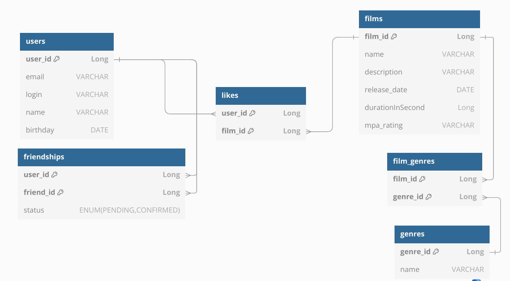

# java-filmorate
Template repository for Filmorate project.

## Основные таблицы

- **users**  
  Хранит информацию о пользователях: уникальный идентификатор, имя, email, login, дата рождения.

- **films**  
  Содержит данные о фильмах: идентификатор, название, описание, жанр, дата релиза, продолжительность, рейтинг.

- **likes**  
  Ассоциативная таблица, связывает пользователей и фильмы по лайкам. Здесь фиксируется, какой пользователь поставил «лайк» какому фильму.

- **friendships**  
  Содержит связи между пользователями, позволяя определять друзей и искать общих друзей между двумя пользователями.

- **film-genres**  
  Дополнительная таблица, служащая для установления связи между фильмом и его жанром. Она позволяет одному фильму иметь несколько жанров, обеспечивая гибкую категоризацию.

### 1. Получение всех фильмов
```sql
SELECT * FROM films;
```

### 2. Получение всех пользователей
```sql
SELECT * FROM users;
```

### 3. Получение топ N наиболее популярных фильмов
```sql
SELECT f.film_id, 
       f.name, 
       COUNT(l.user_id) AS likes_count
FROM films f
JOIN likes l ON f.film_id = l.film_id
GROUP BY f.film_id, f.name
ORDER BY likes_count DESC
LIMIT N;
```

### 4. Получение списка общих друзей для двух пользователей
```sql
SELECT u.user_id, u.name
FROM users u
JOIN friendships f1 ON u.user_id = f1.friend_id
JOIN friendships f2 ON u.user_id = f2.friend_id
WHERE f1.user_id = ? -- Идентификатор первого пользователя
  AND f2.user_id = ?; -- Идентификатор второго пользователя

```